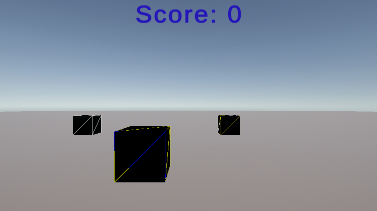

# HW9 - Multiplayer Games

  

  <a href="https://mayarom.itch.io/hw9-multiplayer-games"><b>Download & Play on itch.io (Windows)</b></a>

---

## 1. Overview

This project is my submission for **Homework 9 - Multiplayer Games** in the *Game Development* course.

The work is based on the classroom multiplayer prototype:  
**https://github.com/gamedev-at-ariel/multiplayer-fusion-2.git**

As required in the assignment, I selected **Option 1**, which involves adding **two original networked gameplay systems** on top of the base project.

All development and testing were performed inside the scene:  
### 👉 `Scenes/2b-movement.unity`

The final result is a small 3D real-time multiplayer arena game built with **Unity** and **Photon Fusion**, playable via **Windows standalone build** on itch.io.

Implemented systems include:
- Networked movement  
- Networked projectile firing  
- Hit detection  
- **Custom multiplayer Score System**  
- **Custom multiplayer Health System**  
- Full Host-Client synchronization  

---

## 2. Gameplay Features

### 2.1 Core Gameplay
- Real-time multiplayer with Photon Fusion  
- Synchronized:
  - Player movement  
  - Projectile spawning  
  - Projectile collisions  
  - Health  
  - Score  
  - Player color state  

### 2.2 Custom Additions (Option 1)

Both systems were implemented directly inside **2b-movement.unity**, modifying prefabs, scripts, and UI.

---

## ⭐ 2.2.1 Score System - *Custom Feature #1*

**Purpose:** Award points for successful hits.

**Implementation details:**
- Added `[Networked] int Score` to the player state  
- When launching a projectile, the script assigns a **shooter reference**  
- When the projectile hits another player:
  - Host increases the shooter’s score by +1  
  - Fusion replicates this updated score to all clients  
- UI:
  - Created a local-player `ScoreText` TMP element  
  - Added `ScoreUI.cs` that listens to score changes  

**Outcome:**  
Every player sees their own live score, updated instantly across the network.

---

## ⭐ 2.2.2 Health System - *Custom Feature #2*

**Purpose:** Allow damage and player defeat.

**Implementation details:**
- Added `[Networked] int Health` to the player prefab  
- Health decreases upon projectile impact  
- Host is responsible for updating health values  
- Added `HealthField` (TMP text + NumberField script)  
- UI updates in real time using a `HealthUI` component  

**Outcome:**  
Players have synchronized health, and hits have a real gameplay effect.

---

## 3. How To Play

### 3.1 Controls
**Movement**
- W A S D / Arrow Keys - Move  
- Left Shift - Speed Boost  

**Actions**
- Space - Shoot  
- C - Change player color  

### 3.2 Objective
Dodge incoming fire, hit the other player, increase your score, and avoid losing all your health.

---

## 4. Networking Modes

Supported Photon Fusion modes:
- **Host** - Runs the simulation and participates  
- **Client** - Connects to an existing host  
- **Shared Mode** - Local debugging mode  

---

## 5. Build and Deployment

### 5.1 Windows Build
The assignment build was created as a **Windows Standalone (x86_64)** executable.

You can download the release here:  
**https://mayarom.itch.io/hw9-multiplayer-games**

### 5.2 Development Environment
- Unity **6000.0.24f1 (LTS)**  
- Photon Fusion SDK  

---

## 6. Requirements
- Windows PC  
- Unity 6000.0.24f1 (for development only)  
- Photon App ID (if running multiplayer outside itch.io build)  

---

## 7. Running the Project in Unity

1. Clone the repository  
2. Open the project in Unity  
3. Configure Photon Fusion (App ID)  
4. Open the main multiplayer scene:  
   ### 👉 `Scenes/2b-movement.unity`
5. Run the game as Host or Client  

---

## 8. Technologies Used
- Unity 6000 LTS
- Photon Fusion
- C#
- TextMeshPro
- Unity UI

## 9. High-Level Folder Structure
Assets/
└── Scripts/
    ├── Networking/
    │   ├── NetworkRunnerHandler.cs
    │   └── ProjectileNetworkLogic.cs
    ├── Player/
    │   ├── PlayerMovement.cs
    │   ├── PlayerColorController.cs
    │   ├── PlayerHealth.cs
    │   └── PlayerScore.cs
    ├── Gameplay/
    │   ├── ProjectileController.cs
    │   └── GameManagers.cs
    ├── Prefabs/
    │   ├── Player.prefab
    │   └── Projectile.prefab
    ├── Scenes/
    │   └── 2b-movement.unity  <-- Main assignment scene
    └── UI/
        ├── ScoreDisplay.prefab
        └── HealthDisplay.prefab
